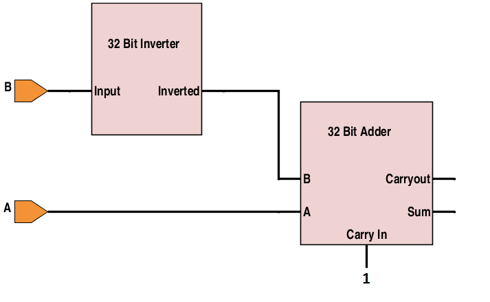
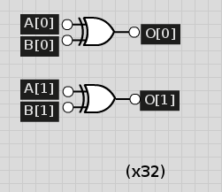

## Computer Architecture Lab 1 Writeup

##### Joey Maalouf, Daniel Bishop, Sean Carter, Gabriel Butterick

### Implementation
Our implementation of the 

### Test Results

<!---  -->

### Timing Analysis
...

### Work Plan Reflection
We took far longer than expected on each and every one of our work sections, leading us to the idea that we should allot far more time than we initially expect to. We expected the logical, mathematical, and shifting operations to take 1 hour per category, but they instead took 6, 5, and 1 respectively.
