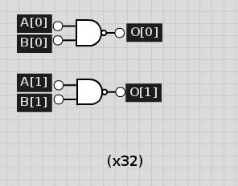

## Computer Architecture Lab 1 Writeup

##### Joey Maalouf, Daniel Bishop, Sean Carter, Gabriel Butterick

### Implementation

##### Adder
Our implementation of the adder uses 32 full-adders, one for each bit. The carry out from each adder is used as the carry in to the next one.

##### Subtracter
Our subtracter is an adder with an inverter on the second input and a carry-in of 1, since A - B is the same as A + -B, and -B = inv(B) + 1.

##### XOR
Our XOR is a simple 1-bit XOR repeated 32 times that, like all of our bitwise logical operations, takes each of the 32 bits in the inputs and writes the individual results to the 32 output bits.

##### Less Than
Our less than operator subtracts the second operand from the first and takes the most significant digit of the output as the result. That digit is 0 if the difference is positive or 0 (A >= B), and 1 if the difference is negative (A < B). Therefore, we can just 0-pad that digit to 32 bits for our output.

##### AND
Our AND is a simple 1-bit AND repeated 32 times that, like all of our bitwise logical operations, takes each of the 32 bits in the inputs and writes the individual results to the 32 output bits.

##### NAND
Our NAND is our AND with inverted output.

##### NOR
Our NOR is our OR with inverted output.

##### OR
Our OR is a simple 1-bit OR repeated 32 times that, like all of our bitwise logical operations, takes each of the 32 bits in the inputs and writes the individual results to the 32 output bits.

##### Shifter
Our shifter uses D-flip-flops to take each bit value in the input and, when the clock fires, move it one bit to the left. The most significant bit wraps around to become the least significant bit.

### Test Results
...

### Timing Analysis
* ADD: 4920
* SUB: 4930
* XOR: 60
* SLT: 4960
* AND: 30
* NAND: 40
* NOR: 40
* OR: 30
* SHFT: 120
* NOT: 10

### Work Plan Reflection
We took far longer than expected on each and every one of our work sections, leading us to the idea that we should allot far more time than we initially expect to. We expected the logical, mathematical, and shifting operations to take 1 hour per category, but they instead took 9, 7, and 3 respectively. The insane idiosyncrasies of Verilog, as well as errors in our assumptions about the way that we would be able to manipulate the code, hampered out ability to construct the circuits that we had fully designed well within our estimated time frame.
