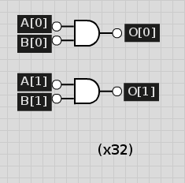

## Computer Architecture Lab 1 Writeup

##### Joey Maalouf, Daniel Bishop, Sean Carter, Gabriel Butterick

### Implementation

##### Adder
Our implementation of the adder uses a single, one-bit full-adder, repeatedly, 32 times. The multiplexers shown have 2 inputs to save space in the image, but they actually run on all 32 bits.

##### Subtracter
Our subtracter is an adder with an inverter on the second input and a carry-in of 1, since A - B is the same as A + -B, and -B = inv(B) + 1.

##### XOR
Our XOR is a simple 1-bit XOR that, like all of our bitwise operations, iterates over each of the 32 bits in the inputs and writes the individual results to the 32 output bits.

##### Less Than

##### AND

##### NAND

##### NOR

##### OR

##### Shifter

### Test Results
...

### Timing Analysis
Shifter: 120
Add: 1000
Sub: 3008
xor: 120
and: 60
nand: 116
nor: 126
not: 56 
or: 70
less than: 5038

### Work Plan Reflection
We took far longer than expected on each and every one of our work sections, leading us to the idea that we should allot far more time than we initially expect to. We expected the logical, mathematical, and shifting operations to take 1 hour per category, but they instead took 6, 5, and 1 respectively.
