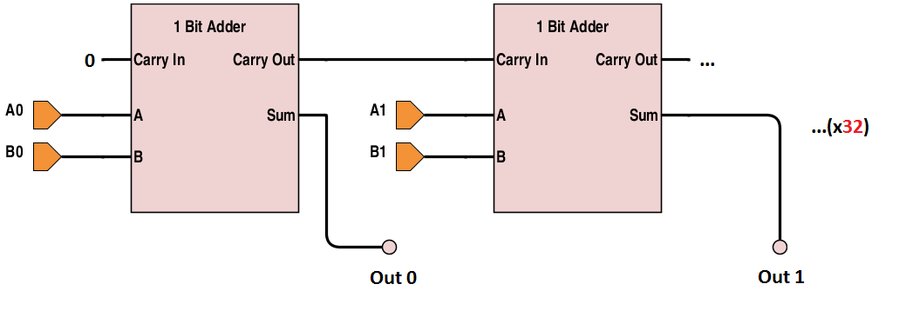
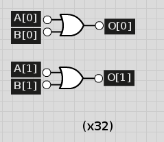

## Computer Architecture Lab 1 Writeup

##### Joey Maalouf, Daniel Bishop, Sean Carter, Gabriel Butterick


### Implementation

##### Adder
Our implementation of the adder uses 32 full-adders, one for each bit. The carry out from each adder is used as the carry in to the next one.



##### Subtracter
Our subtracter is an adder with an inverter on the second input and a carry-in of 1, since A - B is the same as A + -B, and -B = inv(B) + 1.


##### XOR
Our XOR is a simple 1-bit XOR repeated 32 times that, like all of our bitwise logical operations, takes each of the 32 bits in the inputs and writes the individual results to the 32 output bits.


##### Less Than
Our less than operator subtracts the second operand from the first and takes the most significant digit of the output as the result. That digit is 0 if the difference is positive or 0 (A >= B), and 1 if the difference is negative (A < B). Therefore, we can just 0-pad that digit to 32 bits for our output.


##### AND
Our AND is a simple 1-bit AND repeated 32 times that, like all of our bitwise logical operations, takes each of the 32 bits in the inputs and writes the individual results to the 32 output bits.


##### NAND
Our NAND is our AND with inverted output.


##### NOR
Our NOR is our OR with inverted output.


##### OR
Our OR is a simple 1-bit OR repeated 32 times that, like all of our bitwise logical operations, takes each of the 32 bits in the inputs and writes the individual results to the 32 output bits.



##### Shifter
Our shifter uses D-flip-flops to take each bit value in the input and, when the clock fires, move it one bit to the left. The most significant bit wraps around to become the least significant bit.


### Test Results
```
ADD 
A:          00000000000001000001000001001100
B:          00001000101001001001000000001100
Out:      0 00001000101010001010000001011000
Expected: 0 00001000101010001010000001011000

ADD 
A:          00000101000001000001000001001101
B:          00001000101001001001000000001100
Out:      0 00001101101010001010000001011001
Expected: 0 00001101101010001010000001011001

ADD 
A:          11000101000001000001000001001101
B:          10001000101001001001000000001100
Out:      1 01001101101010001010000001011001
Expected: 1 01001101101010001010000001011001

SUB 
A:          00000101000001000001000001001101
B:          00001000101001001001000000001100
Out:      0 11111100010111111000000001000001
Expected: 0 11111100010111111000000001000001

SUB 
A:          01000100000101000001001001001001
B:          00101000001001000001000010001110
Out:      0 00011011111100000000000110111011
Expected: 0 00011011111100000000000110111011

SUB 
A:          01000100000101000001001001001001
B:          10101000001001000001000010001110
Out:      1 10011011111100000000000110111011
Expected: 1 10011011111100000000000110111011

SLT 
A:        01000101100101000001001001001001
B:        10101001001001000001000010001110
Out:      00000000000000000000000000000000
Expected: 00000000000000000000000000000000

SLT 
A:        11000101100101000001001001001001
B:        10101001001001000001000010001110
Out:      00000000000000000000000000000000
Expected: 00000000000000000000000000000000

SLT 
A:        11101001001001000001000001001001
B:        11101001001001000001000001001001
Out:      00000000000000000000000000000000
Expected: 00000000000000000000000000000000

SLT 
A:        11111111111111111111111111111111
B:        00000000000000000000000000000000
Out:      00000000000000000000000000000001
Expected: 00000000000000000000000000000001

SLT 
A:        11111111111111111111111111111111
B:        01111111111111111111111111111111
Out:      00000000000000000000000000000001
Expected: 00000000000000000000000000000001

XOR 
A:        11111111111111111111111111111111
B:        01111111111111111111111111111111
Out:      10000000000000000000000000000000
Expected: 10000000000000000000000000000000

XOR 
A:        11111110111111011111110011110111
B:        01110111111011111110111111100111
Out:      10001001000100100001001100010000
Expected: 10001001000100100001001100010000

AND 
A:        10011110111111011101110011110111
B:        01110111111011001110111000100111
Out:      00010110111011001100110000100111
Expected: 00010110111011001100110000100111

AND 
A:        10011000110011011101100011000111
B:        00010011000011001100011000100111
Out:      00010000000011001100000000000111
Expected: 00010000000011001100000000000111

OR 
A:        10011010110011011101101011000111
B:        01110011011011101100011001100111
Out:      11111011111011111101111011100111
Expected: 11111011111011111101111011100111

OR 
A:        00011010010001011001100000000100
B:        11000011010000101100011001100011
Out:      11011011010001111101111001100111
Expected: 11011011010001111101111001100111

NAND 
A:        00011010011001011001101001001101
B:        11010011010100101100011001100010
Out:      11101101101111110111110110111111
Expected: 11101101101111110111110110111111

NAND 
A:        00011010011001010001001001001101
B:        00010010010100100100010001000010
Out:      11101101101111111111111110111111
Expected: 11101101101111111111111110111111

NOR 
A:        11011010011001010001001001001101
B:        10010010010100100100010001000010
Out:      00100101100010001010100110110000
Expected: 00100101100010001010100110110000

NOR 
A:        11011010011001010111001101001101
B:        01010011110100100100110011001011
Out:      00100100000010001000000000110000
Expected: 00100100000010001000000000110000

SHFT 
A:        11011010011001010111001101001101
Out:      10110100110010101110011010011011
Expected: 10110100110010101110011010011011

SHFT 
A:        01111001001001100100000011100001
Out:      11110010010011001000000111000010
Expected: 11110010010011001000000111000010
```


### Timing Analysis
* ADD: 4920
* SUB: 4930
* XOR: 60
* SLT: 4960
* AND: 30
* NAND: 40
* NOR: 40
* OR: 30
* SHFT: 120
* NOT: 10


### Work Plan Reflection
We took far longer than expected on each and every one of our work sections, leading us to the idea that we should allot far more time than we initially expect to. We expected the logical, mathematical, and shifting operations to take 1 hour per category, but they instead took 9, 7, and 3 respectively. The insane idiosyncrasies of Verilog, as well as errors in our assumptions about the way that we would be able to manipulate the code, hampered out ability to construct the circuits that we had fully designed well within our estimated time frame.
