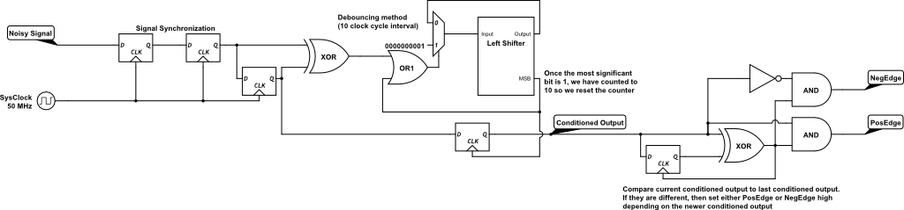
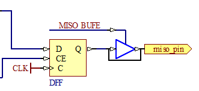

##Lab 2 Report

###Input Conditioner Deliverables (inputconditioner.v)
####Schematic

####Glitch Suppression
If the system clock is at 50MHz and the waittime is 3, then the longest glitch that will be suppressed is just under 3 clock cycles long (<59ns).

###Shift Register
####Test Bench Strategy
<TODO>

###Midpoint Deliverables
####Test Engineer Procedure
To determine the status of the shift register currently loaded onto your FPGA test board, you must ensure that the shift register properly performs bitwise shifts on the stored value on a clock cycle, that the shift register can parse serial input, and that the shift register properly loads values.

To test the shifting capability of the shift register, toggle switch 0 repreatedly. Watch the 4 LEDs above the switches, you should be able to see a pattern travelling from right to left across them (eg: if LED's 2 and 0 are lit up, toggling switch 0 should turn them off and turn LED's 3 and 1 on). After three of four toggles, all LED's should be off as the stored number has been fully bitshifted and all bits replaced with 0's.

#####Test Procedure
| Switch 0 | Switch 1 | Button 0 | LED States |
|----------|----------|----------|------------|
| 0        | 0        | 0        | 0101       |
| 1        | 0        | 0        | 1010       |
| 0        | 0        | 0        | 1010       |
| 1        | 0        | 0        | 0100       |
| 0        | 0        | 0        | 0100       |

To test the serial input function of the shift register, use both switch 0 and switch 1. Switch 1 determines the value acting as the serial input to the shift register (either 0 or 1). By toggling switch 0, the current value of switch 1 will be placed into the currently stored value. For example, setting switch 1 to the ON state and toggling switch 0 should shift the LED light pattern left by one, but should also set the rightmost LED to ON. Experiment with this function to see if you can produce your own patterns in the LED's.

#####Test Procedure
| Switch 0 | Switch 1 | Button 0 | LED States |
|----------|----------|----------|------------|
| 0        | 1        | 0        | 0101       |
| 1        | 1        | 0        | 1011       |
| 0        | 0        | 0        | 1011       |
| 1        | 0        | 0        | 0110       |
| 0        | 0        | 0        | 0110       |
| 1        | 1        | 0        | 1101       |
| 0        | 0        | 0        | 1101       |

To test the parralel input ability of the shift register, simply press button 0. This should reset the LED's to the initial state (factory default is 0101 or OFF-ON-OFF-ON).

#####Test Procedure
| Switch 0 | Switch 1 | Button 0 | LED States |
|----------|----------|----------|------------|
| 0        | 1        | 0        | 0101       |
| 1        | 1        | 0        | 1011       |
| 0        | 0        | 0        | 1011       |
| 1        | 0        | 0        | 0110       |
| 0        | 0        | 1        | 0101       |
| 1        | 1        | 0        | 1011       |
| 0        | 0        | 0        | 1011       |

###SPI Memory
The fault we have injected is that our Finite State Machine's MISO buffer enable signal is stuck high, mimicking a short across the MISO buffer. This means that output will always be passed to the "outside" even when we don't want it to.
####Schematic

A test pattern that will detect this fault is to set the MOSI pin high and cycle the signal clock once. If the MISO pin is undriven, then the error is not present, if the MISO pin is driven to the value of the MOSI pin, the error is present.