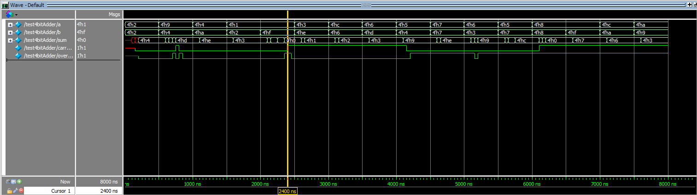
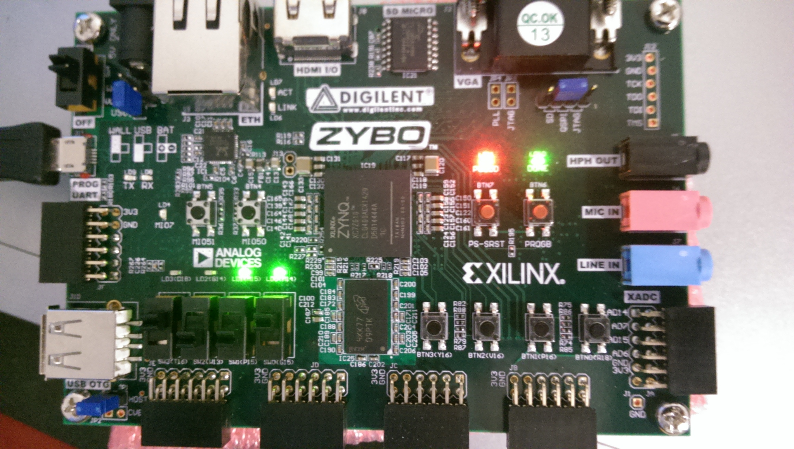
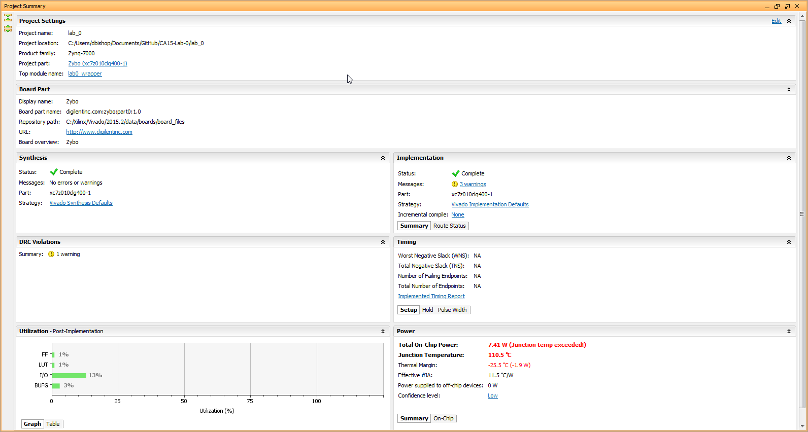

# CA15-Lab-0


## Computer Architecture Lab 0 Writeup

##### Joey Maalouf, Daniel Bishop, Sean Carter, Gabriel Butterick


### Waveforms



Our worst case delay is 400ns.


### Verilog Tests

```
Testing 4-bit Full Adder
Testing Sum:
A    | B    | Sum  | Cout | Overflow
0010 | 0010 | 0100 | 0    | 0
1001 | 0100 | 1101 | 0    | 0
0100 | 1010 | 1110 | 0    | 0
0001 | 0010 | 0011 | 0    | 0
Testing Carryout:
A    | B    | Sum  | Cout | Overflow
0001 | 1111 | 0000 | 1    | 0
0011 | 1110 | 0001 | 1    | 0
1100 | 0110 | 0010 | 1    | 0
0110 | 1101 | 0011 | 1    | 0
Testing Overflow:
A    | B    | Sum  | Cout | Overflow
0101 | 0100 | 1001 | 0    | 1
0111 | 0111 | 1110 | 0    | 1
0110 | 0011 | 1001 | 0    | 1
0101 | 0111 | 1100 | 0    | 1
Testing Everything:
A    | B    | Sum  | Cout | Overflow
1000 | 1000 | 0000 | 1    | 1
1000 | 1111 | 0111 | 1    | 1
1100 | 1010 | 0110 | 1    | 1
1010 | 1001 | 0011 | 1    | 1
```

We chose these sum-testing values because from them, we expect no carryout or overflow, which lets us focus on making sure the sum itself is correct. Similarily, the values we picked for testing carryout and overflow only test those respective outputs to make sure that they all act properly. The final test suite uses numbers that make sure that all of the outputs can fire correctly.

The general idea behind the test benches was to test every individual output on its own before testing them all together. The test bench was designed this way to illuminate any errors on a specific level along the adder process. We didn't encounter any errors on any individual level, and when we tested them on a systemic level there couldn't be any issues.


### FPGA Tests

We ran the same 16 tests (listed above) that we used on the Verilog simulation, and each one worked. The image below shows test #16.




### Summary Statistics

What used the most resources was the input and output, which makes sense since we have many buttons, switches, and LEDs to manage compared to the relatively few calculations we do.


